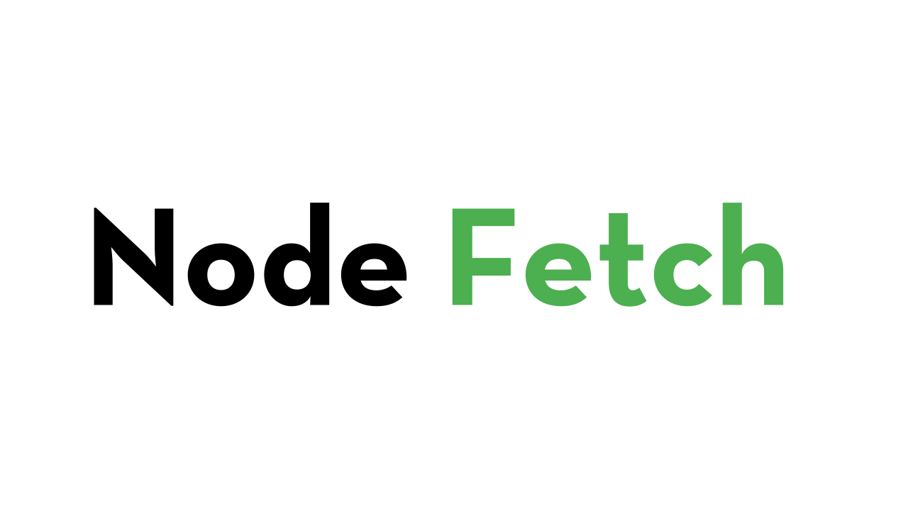

<div align="center">
  
  <br>
  <p>A light-weight module that brings <code>window.fetch</code> to Node.js.</p>
</div>

[![build status][travis-image]][travis-url]
[![coverage status][codecov-image]][codecov-url]
[![install size][install-size-image]][install-size-url]
[![Discord][discord-image]][discord-url]

[](https://nodei.co/npm/node-fetch/)

**Consider supporting us on our Open Collective:**

[![Donate to our collective][opencollective-image]][opencollective-url]

---

<!-- TOC -->

- [Motivation](#motivation)
- [Features](#features)
- [Difference from client-side fetch](#difference-from-client-side-fetch)
- [Installation](#installation)
- [Loading and configuring the module](#loading-and-configuring-the-module)
- [Upgrading](#upgrading)
- [Common Usage](#common-usage)
    - [Plain text or HTML](#plain-text-or-html)
    - [JSON](#json)
    - [Simple Post](#simple-post)
    - [Post with JSON](#post-with-json)
    - [Post with form parameters](#post-with-form-parameters)
    - [Handling exceptions](#handling-exceptions)
    - [Handling client and server errors](#handling-client-and-server-errors)
- [Advanced Usage](#advanced-usage)
    - [Streams](#streams)
    - [Buffer](#buffer)
    - [Accessing Headers and other Meta data](#accessing-headers-and-other-meta-data)
    - [Extract Set-Cookie Header](#extract-set-cookie-header)
    - [Post data using a file stream](#post-data-using-a-file-stream)
    - [Post with form-data (detect multipart)](#post-with-form-data-detect-multipart)
    - [Request cancellation with AbortSignal](#request-cancellation-with-abortsignal)
- [API](#api)
    - [fetch(url[, options])](#fetchurl-options)
    - [Options](#options)
        - [Default Headers](#default-headers)
        - [Custom Agent](#custom-agent)
        - [Custom highWaterMark](#custom-highwatermark)
    - [Class: Request](#class-request)
        - [new Request(input[, options])](#new-requestinput-options)
    - [Class: Response](#class-response)
        - [new Response([body[, options]])](#new-responsebody-options)
        - [response.ok](#responseok)
        - [response.redirected](#responseredirected)
    - [Class: Headers](#class-headers)
        - [new Headers([init])](#new-headersinit)
    - [Interface: Body](#interface-body)
        - [body.body](#bodybody)
        - [body.bodyUsed](#bodybodyused)
        - [body.arrayBuffer()](#bodyarraybuffer)
        - [body.blob()](#bodyblob)
        - [body.json()](#bodyjson)
        - [body.text()](#bodytext)
        - [body.buffer()](#bodybuffer)
    - [Class: FetchError](#class-fetcherror)
    - [Class: AbortError](#class-aborterror)
- [TypeScript](#typescript)
- [Acknowledgement](#acknowledgement)
- [Team](#team)
                - [Former](#former)
- [License](#license)

<!-- /TOC -->

## Motivation

Instead of implementing `XMLHttpRequest` in Node.js to run browser-specific [Fetch polyfill](https://github.com/github/fetch), why not go from native `http` to `fetch` API directly? Hence `node-fetch`, minimal code for a `window.fetch` compatible API on Node.js runtime.

See Matt Andrews' [isomorphic-fetch](https://github.com/matthew-andrews/isomorphic-fetch) or Leonardo Quixada's [cross-fetch](https://github.com/lquixada/cross-fetch) for isomorphic usage (exports `node-fetch` for server-side, `whatwg-fetch` for client-side).

## Features

- Stay consistent with `window.fetch` API.
- Make conscious trade-off when following [WHATWG fetch spec][whatwg-fetch] and [stream spec](https://streams.spec.whatwg.org/) implementation details, document known differences.
- Use native promise, but allow substituting it with [insert your favorite promise library].
- Use native Node streams for body, on both request and response.
- Decode content encoding (gzip/deflate) properly, and convert string output (such as `res.text()` and `res.json()`) to UTF-8 automatically.
- Useful extensions such as timeout, redirect limit, response size limit, [explicit errors][error-handling.md] for troubleshooting.

## Difference from client-side fetch

- See known differences:
	- [As of v3.x](docs/v3-LIMITS.md)
	- [As of v2.x](docs/v2-LIMITS.md)
- If you happen to use a missing feature that `window.fetch` offers, feel free to open an issue.
- Pull requests are welcomed too!

## Installation

Current stable release (`3.x`)

```sh
$ npm install node-fetch
```

## Loading and configuring the module

We suggest you load the module via `require`, pending the stabalizing of es modules in node:

```js
const fetch = require('node-fetch');
```

If you are using a Promise library other than native, set it through `fetch.Promise`:

```js
const fetch = require('node-fetch');
const Bluebird = require('bluebird');

fetch.Promise = Bluebird;
```

If you want to patch the global object in node:

```js
const fetch = require('node-fetch');

if (!globalThis.fetch) {
    globalThis.fetch = fetch;
}
```

For versions of node earlier than 12.x, use this `globalThis` [polyfill](https://mathiasbynens.be/notes/globalthis):

```js
(function() {
	if (typeof globalThis === 'object') return;
	Object.defineProperty(Object.prototype, '__magic__', {
		get: function() {
			return this;
		},
		configurable: true
	});
	__magic__.globalThis = __magic__;
	delete Object.prototype.__magic__;
}());
```

## Upgrading

Using an old version of node-fetch? Check out the following files:

- [2.x to 3.x upgrade guide](docs/v3-UPGRADE-GUIDE.md)
- [1.x to 2.x upgrade guide](docs/v2-UPGRADE-GUIDE.md)
- [Changelog](docs/CHANGELOG.md)

## Common Usage

NOTE: The documentation below is up-to-date with `3.x` releases, if you are using an older version, please check how to [upgrade](#upgrading).

### Plain text or HTML

```js
const fetch = require('node-fetch');

fetch('https://github.com/')
	.then(res => res.text())
	.then(body => console.log(body));
```

### JSON

```js
const fetch = require('node-fetch');

fetch('https://api.github.com/users/github')
	.then(res => res.json())
	.then(json => console.log(json));
```

### Simple Post

```js
const fetch = require('node-fetch');

fetch('https://httpbin.org/post', {method: 'POST', body: 'a=1'})
	.then(res => res.json()) // expecting a json response
	.then(json => console.log(json));
```

### Post with JSON

```js
const fetch = require('node-fetch');

const body = {a: 1};

fetch('https://httpbin.org/post', {
	method: 'post',
	body: JSON.stringify(body),
	headers: {'Content-Type': 'application/json'}
})
	.then(res => res.json())
	.then(json => console.log(json));
```

### Post with form parameters

`URLSearchParams` is available on the global object in Node.js as of v10.0.0. See [official documentation](https://nodejs.org/api/url.html#url_class_urlsearchparams) for more usage methods.

NOTE: The `Content-Type` header is only set automatically to `x-www-form-urlencoded` when an instance of `URLSearchParams` is given as such:

```js
const fetch = require('node-fetch');

const params = new URLSearchParams();
params.append('a', 1);

fetch('https://httpbin.org/post', {method: 'POST', body: params})
	.then(res => res.json())
	.then(json => console.log(json));
```

### Handling exceptions

NOTE: 3xx-5xx responses are _NOT_ exceptions, and should be handled in `then()`, see the next section.

Adding a catch to the fetch promise chain will catch _all_ exceptions, such as errors originating from node core libraries, like network errors, and operational errors which are instances of FetchError. See the [error handling document][error-handling.md] for more details.

```js
const fetch = require('node-fetch');

fetch('https://domain.invalid/').catch(err => console.error(err));
```

### Handling client and server errors

It is common to create a helper function to check that the response contains no client (4xx) or server (5xx) error responses:

```js
const fetch = require('node-fetch');

function checkStatus(res) {
	if (res.ok) {
		// res.status >= 200 && res.status < 300
		return res;
	} else {
		throw MyCustomError(res.statusText);
	}
}

fetch('https://httpbin.org/status/400')
	.then(checkStatus)
	.then(res => console.log('will not get here...'));
```

## Advanced Usage

### Streams

The "Node.js way" is to use streams when possible:

```js
const {createWriteStream} = require('fs');
const fetch = require('node-fetch');

fetch(
	'https://octodex.github.com/images/Fintechtocat.png'
).then(res => {
	const dest = fs.createWriteStream('./octocat.png');
	res.body.pipe(dest);
});
```

### Buffer

If you prefer to cache binary data in full, use buffer(). (NOTE: buffer() is a `node-fetch` only API)

```js
const fetch = require('node-fetch');
const fileType = require('file-type');

fetch('https://octodex.github.com/images/Fintechtocat.png')
	.then(res => res.buffer())
	.then(buffer => fileType(buffer))
	.then(type => {
		console.log(type);
	});
```

### Accessing Headers and other Meta data

```js
const fetch = require('node-fetch');

fetch('https://github.com/').then(res => {
	console.log(res.ok);
	console.log(res.status);
	console.log(res.statusText);
	console.log(res.headers.raw());
	console.log(res.headers.get('content-type'));
});
```

### Extract Set-Cookie Header

Unlike browsers, you can access raw `Set-Cookie` headers manually using `Headers.raw()`, this is a `node-fetch` only API.

```js
const fetch = require('node-fetch');

fetch('https://example.com').then(res => {
	// returns an array of values, instead of a string of comma-separated values
	console.log(res.headers.raw()['set-cookie']);
});
```

### Post data using a file stream

```js
const {createReadStream} = require('fs');
const fetch = require('node-fetch');

const stream = createReadStream('input.txt');

fetch('https://httpbin.org/post', {method: 'POST', body: stream})
	.then(res => res.json())
	.then(json => console.log(json));
```

### Post with form-data (detect multipart)

```js
const fetch = require('node-fetch');
const FormData = require('form-data');

const form = new FormData();
form.append('a', 1);

fetch('https://httpbin.org/post', {method: 'POST', body: form})
	.then(res => res.json())
	.then(json => console.log(json));

// OR, using custom headers
// NOTE: getHeaders() is non-standard API

const options = {
	method: 'POST',
	body: form,
	headers: form.getHeaders()
};

fetch('https://httpbin.org/post', options)
	.then(res => res.json())
	.then(json => console.log(json));
```

### Request cancellation with AbortSignal

You may cancel requests with `AbortController`. A suggested implementation is [`abort-controller`](https://www.npmjs.com/package/abort-controller).

An example of timing out a request after 150ms could be achieved as follows:

```js
const fetch = require('node-fetch');
const AbortController = require('abort-controller');

const controller = new AbortController();
const timeout = setTimeout(() => {
	controller.abort();
}, 150);

fetch('https://example.com', {signal: controller.signal})
	.then(res => res.json())
	.then(
		data => {
			useData(data);
		},
		err => {
			if (err.name === 'AbortError') {
                console.log('request was aborted');
			}
		}
	)
	.finally(() => {
		clearTimeout(timeout);
	});
```

See [test cases](https://github.com/node-fetch/node-fetch/blob/master/test/test.js) for more examples.

## API

### fetch(url[, options])

- `url` A string representing the URL for fetching
- `options` [Options](#fetch-options) for the HTTP(S) request
- Returns: <code>Promise&lt;[Response](#class-response)&gt;</code>

Perform an HTTP(S) fetch.

`url` should be an absolute url, such as `https://example.com/`. A path-relative URL (`/file/under/root`) or protocol-relative URL (`//can-be-http-or-https.com/`) will result in a rejected promise.

<a id="fetch-options"></a>

### Options

The default values are shown after each option key.

```js
{
    // These properties are part of the Fetch Standard
    method: 'GET',
    headers: {},            // request headers. format is the identical to that accepted by the Headers constructor (see below)
    body: null,             // request body. can be null, a string, a Buffer, a Blob, or a Node.js Readable stream
    redirect: 'follow',     // set to `manual` to extract redirect headers, `error` to reject redirect
    signal: null,           // pass an instance of AbortSignal to optionally abort requests

    // The following properties are node-fetch extensions
    follow: 20,             // maximum redirect count. 0 to not follow redirect
    timeout: 0,             // req/res timeout in ms, it resets on redirect. 0 to disable (OS limit applies). Signal is recommended instead.
    compress: true,         // support gzip/deflate content encoding. false to disable
    size: 0,                // maximum response body size in bytes. 0 to disable
    agent: null             // http(s).Agent instance or function that returns an instance (see below)
    highWaterMark: 16384    // the maximum number of bytes to store in the internal buffer before ceasing to read from the underlying resource.
}
```

#### Default Headers

If no values are set, the following request headers will be sent automatically:

| Header              | Value                                                    |
| ------------------- | -------------------------------------------------------- |
| `Accept-Encoding`   | `gzip,deflate` _(when `options.compress === true`)_      |
| `Accept`            | `*/*`                                                    |
| `Connection`        | `close` _(when no `options.agent` is present)_           |
| `Content-Length`    | _(automatically calculated, if possible)_                |
| `Transfer-Encoding` | `chunked` _(when `req.body` is a stream)_                |
| `User-Agent`        | `node-fetch (+https://github.com/node-fetch/node-fetch)` |

Note: when `body` is a `Stream`, `Content-Length` is not set automatically.

#### Custom Agent

The `agent` option allows you to specify networking related options that's out of the scope of Fetch. Including and not limit to:

- Support self-signed certificate
- Use only IPv4 or IPv6
- Custom DNS Lookup

See [`http.Agent`](https://nodejs.org/api/http.html#http_new_agent_options) for more information.

In addition, `agent` option accepts a function that returns http(s).Agent instance given current [URL](https://nodejs.org/api/url.html), this is useful during a redirection chain across HTTP and HTTPS protocol.

```js
const http = require('http');
const https = require('https');

const httpAgent = new http.Agent({
	keepAlive: true
});
const httpsAgent = new https.Agent({
	keepAlive: true
});

const options = {
	agent: function(_parsedURL) {
		if (_parsedURL.protocol == 'http:') {
			return httpAgent;
		} else {
			return httpsAgent;
		}
	}
};
```

<a id="custom-highWaterMark"></a>

#### Custom highWaterMark

Stream on Node.js have a smaller internal buffer size (16Kb, aka `highWaterMark`) from client-side browsers (>1Mb, not consistent across browsers). Because of that, when you are writing an isomorphic app and using `res.clone()`, it will hang with large response in Node.

The recommended way to fix this problem is to resolve cloned response in parallel:

```js
const fetch = require('node-fetch');

fetch('https://example.com').then(res => {
	const r1 = res.clone();

	return Promise.all([res.json(), r1.text()]).then(results => {
		console.log(results[0]);
		console.log(results[1]);
	});
});
```

If for some reason you don't like the solution above, since `3.x` you are able to modify the `highWaterMark` option:

```js
const fetch = require('node-fetch');

fetch('https://example.com', {highWaterMark: 10}).then(res => res.clone().buffer());
```

<a id="class-request"></a>

### Class: Request

An HTTP(S) request containing information about URL, method, headers, and the body. This class implements the [Body](#iface-body) interface.

Due to the nature of Node.js, the following properties are not implemented at this moment:

- `type`
- `destination`
- `referrer`
- `referrerPolicy`
- `mode`
- `credentials`
- `cache`
- `integrity`
- `keepalive`

The following node-fetch extension properties are provided:

- `follow`
- `compress`
- `counter`
- `agent`
- `highWaterMark`

See [options](#fetch-options) for exact meaning of these extensions.

#### new Request(input[, options])

<small>_(spec-compliant)_</small>

- `input` A string representing a URL, or another `Request` (which will be cloned)
- `options` [Options][#fetch-options] for the HTTP(S) request

Constructs a new `Request` object. The constructor is identical to that in the [browser](https://developer.mozilla.org/en-US/docs/Web/API/Request/Request).

In most cases, directly `fetch(url, options)` is simpler than creating a `Request` object.

<a id="class-response"></a>

### Class: Response

An HTTP(S) response. This class implements the [Body](#iface-body) interface.

The following properties are not implemented in node-fetch at this moment:

- `Response.error()`
- `Response.redirect()`
- `type`
- `trailer`

#### new Response([body[, options]])

<small>_(spec-compliant)_</small>

- `body` A string or [Readable stream][node-readable]
- `options` A [`ResponseInit`][response-init] options dictionary

Constructs a new `Response` object. The constructor is identical to that in the [browser](https://developer.mozilla.org/en-US/docs/Web/API/Response/Response).

Because Node.js does not implement service workers (for which this class was designed), one rarely has to construct a `Response` directly.

#### response.ok

<small>_(spec-compliant)_</small>

Convenience property representing if the request ended normally. Will evaluate to true if the response status was greater than or equal to 200 but smaller than 300.

#### response.redirected

<small>_(spec-compliant)_</small>

Convenience property representing if the request has been redirected at least once. Will evaluate to true if the internal redirect counter is greater than 0.

<a id="class-headers"></a>

### Class: Headers

This class allows manipulating and iterating over a set of HTTP headers. All methods specified in the [Fetch Standard][whatwg-fetch] are implemented.

#### new Headers([init])

<small>_(spec-compliant)_</small>

- `init` Optional argument to pre-fill the `Headers` object

Construct a new `Headers` object. `init` can be either `null`, a `Headers` object, an key-value map object, or any iterable object.

```js
// Example adapted from https://fetch.spec.whatwg.org/#example-headers-class
const Headers = require('node-fetch');

const meta = {
	'Content-Type': 'text/xml',
	'Breaking-Bad': '<3'
};
const headers = new Headers(meta);

// The above is equivalent to
const meta = [['Content-Type', 'text/xml'], ['Breaking-Bad', '<3']];
const headers = new Headers(meta);

// You can in fact use any iterable objects, like a Map or even another Headers
const meta = new Map();
meta.set('Content-Type', 'text/xml');
meta.set('Breaking-Bad', '<3');
const headers = new Headers(meta);
const copyOfHeaders = new Headers(headers);
```

<a id="iface-body"></a>

### Interface: Body

`Body` is an abstract interface with methods that are applicable to both `Request` and `Response` classes.

The following methods are not yet implemented in node-fetch at this moment:

- `formData()`

#### body.body

<small>_(deviation from spec)_</small>

- Node.js [`Readable` stream][node-readable]

The data encapsulated in the `Body` object. Note that while the [Fetch Standard][whatwg-fetch] requires the property to always be a WHATWG `ReadableStream`, in node-fetch it is a Node.js [`Readable` stream][node-readable].

#### body.bodyUsed

<small>_(spec-compliant)_</small>

- `Boolean`

A boolean property for if this body has been consumed. Per spec, a consumed body cannot be used again.

#### body.arrayBuffer()

#### body.blob()

#### body.json()

#### body.text()

<small>_(spec-compliant)_</small>

- Returns: `Promise`

Consume the body and return a promise that will resolve to one of these formats.

#### body.buffer()

<small>_(node-fetch extension)_</small>

- Returns: `Promise<Buffer>`

Consume the body and return a promise that will resolve to a Buffer.

<a id="class-fetcherror"></a>

### Class: FetchError

<small>_(node-fetch extension)_</small>

An operational error in the fetching process. See [ERROR-HANDLING.md][] for more info.

<a id="class-aborterror"></a>

### Class: AbortError

<small>_(node-fetch extension)_</small>

An Error thrown when the request is aborted in response to an `AbortSignal`'s `abort` event. It has a `name` property of `AbortError`. See [ERROR-HANDLING.MD][] for more info.

## TypeScript

Since `3.x` types are bundled with `node-fetch`, so you don't need to install any additional packages.

For older versions please use the type definitions from [DefinitelyTyped](https://github.com/DefinitelyTyped/DefinitelyTyped):

```sh
$ npm install --save-dev @types/node-fetch
```

## Acknowledgement

Thanks to [github/fetch](https://github.com/github/fetch) for providing a solid implementation reference.

## Team

[](https://github.com/bitinn) | [](https://github.com/jimmywarting) | [](https://github.com/xxczaki) | [](https://github.com/Richienb) | [](https://github.com/gr2m)
---|---|---|---|---
[David Frank](https://bitinn.net/) | [Jimmy Wärting](https://jimmy.warting.se/) | [Antoni Kepinski](https://kepinski.me) | [Richie Bendall](https://www.richie-bendall.ml/) | [Gregor Martynus](https://twitter.com/gr2m)

###### Former

- [Timothy Gu](https://github.com/timothygu)
- [Jared Kantrowitz](https://github.com/jkantr)

## License

MIT

[travis-image]: https://img.shields.io/travis/com/node-fetch/node-fetch/master?style=flat-square
[travis-url]: https://travis-ci.com/node-fetch/node-fetch
[codecov-image]: https://img.shields.io/codecov/c/gh/node-fetch/node-fetch/master?style=flat-square
[codecov-url]: https://codecov.io/gh/node-fetch/node-fetch
[opencollective-image]: https://opencollective.com/node-fetch/donate/button.png?color=blue
[opencollective-url]: https://opencollective.com/node-fetch
[install-size-image]: https://flat.badgen.net/packagephobia/install/node-fetch
[install-size-url]: https://packagephobia.now.sh/result?p=node-fetch
[discord-image]: https://img.shields.io/discord/619915844268326952?color=%237289DA&label=Discord&style=flat-square
[discord-url]: https://discord.gg/Zxbndcm
[whatwg-fetch]: https://fetch.spec.whatwg.org/
[response-init]: https://fetch.spec.whatwg.org/#responseinit
[node-readable]: https://nodejs.org/api/stream.html#stream_readable_streams
[mdn-headers]: https://developer.mozilla.org/en-US/docs/Web/API/Headers
[error-handling.md]: https://github.com/node-fetch/node-fetch/blob/master/docs/ERROR-HANDLING.md
